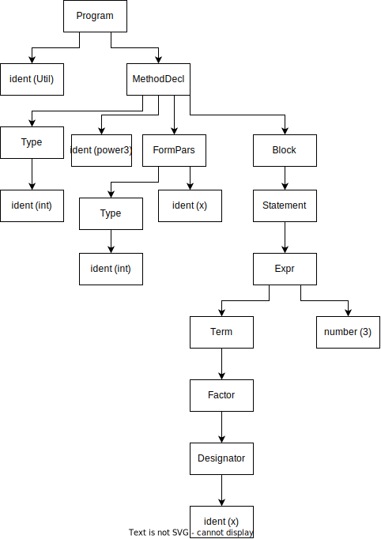

## 1a

kuerzeste form von `FormPars` ist `Type ident`, kuerzeste form von `Type` ist `ident`. kuerzeste form insgesamt also `ident ident` (zb `a b`).

## 1b

`Statement` ist direkt zentral- und rechtsrekursiv und indirekt zentralrekursiv ueber `Block`

`Factor` ist indirekt zentralrekursiv ueber `[Designator] -> Expr -> Term`

`MethodDecl` ist nicht rekursiv

## 1c



nicht mehrdeutig

## 1d

```
First(VarDecl) = ident
First(Relop) = "==", "!=", ">", ">=", "<", "<="
First(Statement) = ident, "if", "while", "break", "return", "read", "print", "{", ";"
```

```
Follow(VarDecl) = "}", "{", ident
Follow(Relop) = "-", ident, "]", number, charConst, "new", "("
Follow(Statement) = "}", "else"
```

## 2

```
AddressList = Entry { ";" Entry } "." .

Entry = DeviceName ":" Address [ EntryDescription ] .
DeviceName = word { word } .
EntryDescription = "(" word { word | number } ")" .

Address = 
    (("+" hex hex hex hex) | ("-" hex hex)) "."
    (hex [ hex ]) "."
    (hex hex hex) "."
    (hex { hex })
    .
```

## 3

direkte linksrekursion in `Params` und `Expr`

```
Func = ... .
Params = ident { "," ident } .
Expr = Value { ("+" | "minus") Value } .
Value = ident | number .
```
