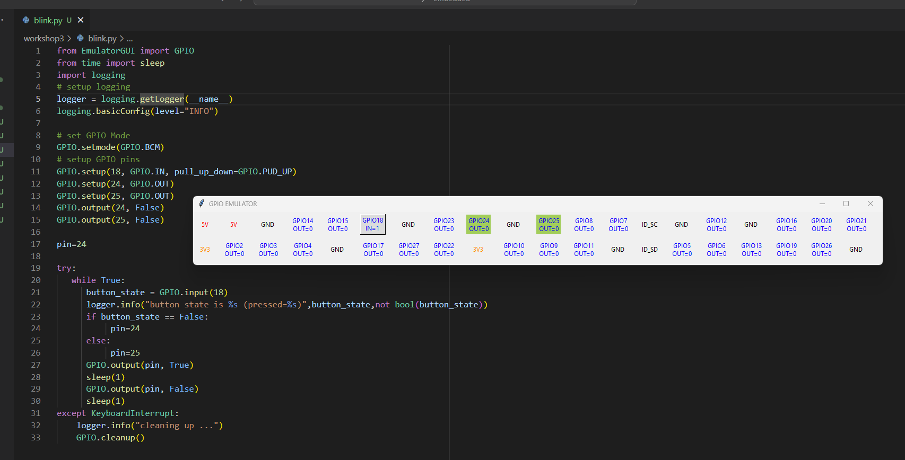

## 1. Actuators

a) 

while the button is not pressed, the led on pin 25 is blinking. if it is pressed, the led on pin 24 is blinking.

b)

observed behaviour is the same, except that the button now acts as a toggle for which of the two leds is blinking (toggled by press and release).

implementation is different since the button handling code is ran in a separate thread and controls the main loop via a global variable.

## 2. Connectivity

a)

```py
if proto_msg.ledControl.action==LedAction.Value('ON'):
    GPIO.output(led_pin,1)
else:
    GPIO.output(led_pin,0)
```

b)

```py
// Publish LedControl with color=red, action=on, togglerate=0
connector.sendLedControl(Led.RED, LedAction.ON, 0);
Thread.sleep(5000);

// Publish LedControl with color=red, action=off, togglerate=0
connector.sendLedControl(Led.RED, LedAction.OFF, 0);
Thread.sleep(5000);

// Publish LedControl with color=green, action=on, togglerate=0
connector.sendLedControl(Led.GREEN, LedAction.ON, 0);
Thread.sleep(5000);

// Publish LedControl with color=green, action=off, togglerate=0
connector.sendLedControl(Led.GREEN, LedAction.OFF, 0);
Thread.sleep(5000);
```

## 3. Message Format

a) 

```
INFO  a.j.p.eps.ProtobufMqttProgram - message size 11
INFO  a.j.p.eps.ProtobufMqttProgram - message size 9
INFO  a.j.p.eps.ProtobufMqttProgram - message size 13
INFO  a.j.p.eps.ProtobufMqttProgram - message size 11
```

```
INFO  at.jku.pervasive.eps.TextMqttProgram - message size 48
INFO  at.jku.pervasive.eps.TextMqttProgram - message size 46
INFO  at.jku.pervasive.eps.TextMqttProgram - message size 46
INFO  at.jku.pervasive.eps.TextMqttProgram - message size 46
INFO  at.jku.pervasive.eps.TextMqttProgram - message size 45
INFO  at.jku.pervasive.eps.TextMqttProgram - message size 49
```

b)

Protobuf payloads are not self-describing, so they don't send field names etc., which makes them smaller. JSON is self-describing, field names are sent along, in addition to unnecessary characters that might be added during serialization (quotes around strings, etc.), the messages are thus larger. A potential benefit is flexibility (depending on what is targeted, clients might have JSON parsing out of the box but not protobuf), and easier debugging (human readability).
